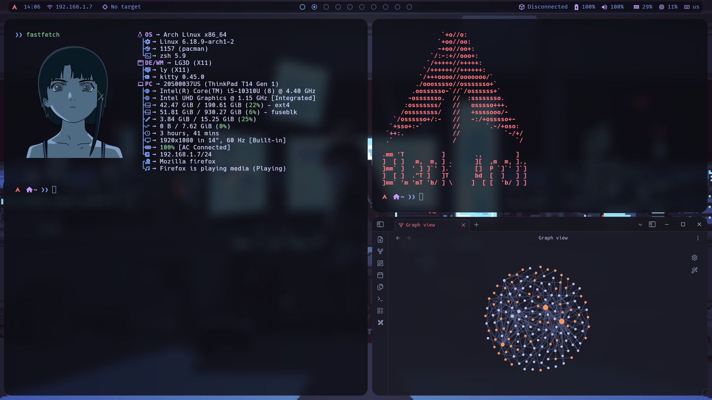

| OS         | [Arch](https://archlinux.org/download/)                                                        |
| ---------- | ---------------------------------------------------------------------------------------------- |
| WM         | [BSPWM](https://github.com/baskerville/bspwm)                                                  |
| Bar        | [Polybar](https://github.com/polybar/polybar)                                                  |
| Menu       | [Rofi](https://github.com/davatorium/rofi)                                                     |
| Compositor | [Picom](https://github.com/yshui/picom)                                                        |
| Terminal   | [Kitty](https://github.com/kovidgoyal/kitty)                                                   |
| Shell      | [zsh](https://github.com/zsh-users/zsh) whith [p10k](https://github.com/romkatv/powerlevel10k) |


This is all of my Arch linux dotfiles

```bash
sudo pacman -Syu
```

If you don't have paru, you can intall it with this commands

```bash
sudo pacman -S --needed base-devel git
git clone https://aur.archlinux.org/paru.git
cd paru
makepkg -si
```

### Base packages

```bash
sudo pacman -S bspwm sxhkd rofi feh kitty wget curl git clang vim nano net-tools moreutils obsidian keepassxc firefox lxappearance pulseaudio picom xorg
```

```bash
git clone --depth=1 https://github.com/romkatv/powerlevel10k.git ~/powerlevel10k
```

### Fonts

```bash
sudo pacman -S ttf-hack ttf-fira-code
```

```bash
paru -S ttf-jetbrains-mono ttf-jetbrains-mono-nerd ttf-jetbrains-mono-variants otf-jetbrains-mono
```

### Themes

```
paru -S tokyonight-gtk-theme-git xcursor-simp1e-tokyo-night
```

### Icons

```bash
sudo pacman -S papirus-icon-theme
```

### Black arch repos

```bash
curl -O https://blackarch.org/strap.sh
chmod +x strap.sh
sudo ./strap.sh
```

### Wallpapers

```bash
git clone https://github.com/Sn0wBaall/Wallpapers
```


